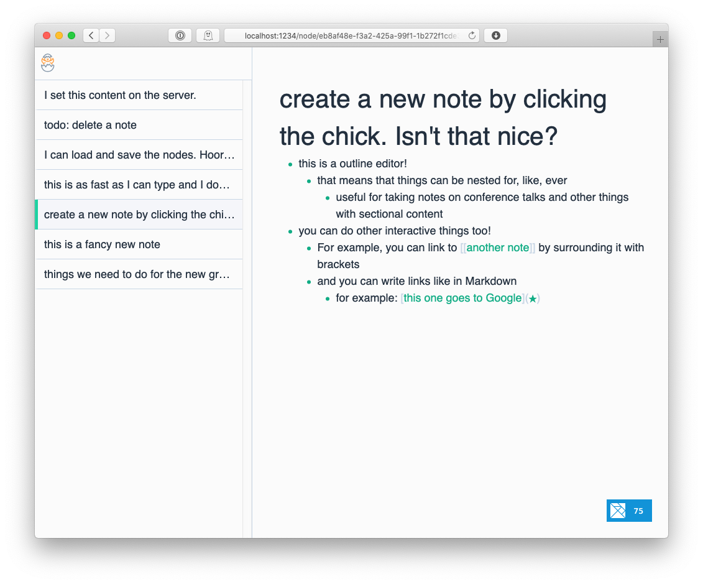

# Notes

This is my implementation of a note-taking app, organized around the following principles:

- **Linking creates structure as necessary.**
  Having to choose a category or folder for notes just makes me tired.
  I want to write and connect stuff as I think of it.
  Structure will emerge where it needs to!
  I should also be able to see all linked/unlinked references to a note.

- **Notes are for _me_.**
  Sharing is important but secondary, and exporting should be fine in most cases.
  Note, though, that this means I want importing to work great so I can slurp in stuff from multiple places!

- **Anything I can see, I can edit.**
  There should be as few read-only views in the app as I can manage.

- **Keyboard shortcuts for the win.**
  I want to be able to navigate completely with the keyboard.
  Vim-ish keybindings, if possible!

- **If I can't organize things I need to do, I'm not going to use the tool.**
  It should handle TODOs nicely (due/defer, mark/complete/cancel, recurrence rules?)
  It should also be possible to reorder/filter todos in some sort of aggregate view.

- **Aggregate views reveal structure.**
  These look like queries.
  Maybe I want to see only the first marked TODO in each note?
  Should be doable.

## Keyboard Shortcuts

| Shortcut                                         | Action                          | Implemented |
|--------------------------------------------------|---------------------------------|-------------|
| <kbd>Alt</kbd>-<kbd>Up</kbd>                     | Move edit cursor up             | No          |
| <kbd>Alt</kbd>-<kbd>Shift</kbd>-<kbd>Up</kbd>    | Move node up                    | No          |
| <kbd>Alt</kbd>-<kbd>Down</kbd>                   | Move edit cursor down           | No          |
| <kbd>Alt</kbd>-<kbd>Shift</kbd>-<kbd>Down</kbd>  | Move node down                  | No          |
| <kbd>Alt</kbd>-<kbd>Right</kbd>                  | Move edit cursor to first child | No          |
| <kbd>Alt</kbd>-<kbd>Shift</kbd>-<kbd>Right</kbd> | Indent                          | No          |
| <kbd>Alt</kbd>-<kbd>Left</kbd>                   | Move edit cursor to parent      | No          |
| <kbd>Alt</kbd>-<kbd>Shift</kbd>-<kbd>Left</kbd>  | Dedent                          | No          |
| <kbd>Tab</kbd>                                   | Indent                          | Yes         |
| <kbd>Shift</kbd>-<kbd>Tab</kbd>                  | Dedent                          | Yes         |
| <kbd>Enter</kbd>                                 | Split node at cursor            | Yes         |
| <kbd>Backspace</kbd>                             | Join nodes                      | Yes         |
| <kbd>Esc</kbd>                                   | Stop editing                    | Yes         |

## Interaction Ideas

- It'd be cool to be able to select/export a group of notes.
  These could either be viewed in a read-only mode or imported into someone else's database.
  I guess it would also be possible to structure the export with CRDTs for easy merges.
- It'd be cool to persistently save a database somewhere shared, but that potentially violates the "no formal structure" principle so it needs to be done carefully.
- It'd be super slick to do something like [idea fight](https://idea-fight.hoelz.ro) where one could order the children of a node.

## Next things to do

- [x] basic tree editing
   - [x] ability to move a node up and down as well as in and out
       - [x] moving up and down to siblings
       - [x] if you're at the first child, moving up goes to the parent.
       - [x] if you're at the last child, moving down goes to the parent's next sibling.
- [x] persistence
- [x] nice design
- [x] navigation by link
- [x] sidebar improvements
   - [x] display and sort by last modified time
   - [x] show first couple rows of content
- [x] package to be deployed by Nix
- [x] links to a note should change if you change the title
- [x] backlinking
- [ ] syncing with CouchDB / PouchDB servers
- [ ] the module layout reflects some old design ideas (`Node.Content`, `Node` being separate from `Database.Row`)
- [ ] too many things are named `Node`. There's `Node`, `Node.Content.Node`, and I think a few others
- [ ] there aren't any inline formats. I'd like *italic*, **bold**, and `inline code` at a minimum. Possibly `:highlights:` or `~strikethrough~` too?
- [ ] I'd like a few more block formats too... `>` for blockquotes in particular
- [ ] tree editing
   - [ ] moving edit focus around
       - [ ] hitting alt-up and alt-down should go to the previous/next sibling
   - refinements on existing behavior
     - [x] move to the previous sibling when I backspace through a node
     - [ ] hitting tab/shift-tab should preserve the cursor position, if possible
         - Html.Keyed? Blocking keyup defaults as well as keydown?
     - [ ] alt-shift-up and alt-shift-down to move nodes
     - [ ] preserve cursor position when joining nodes with backspace (put it at the join point)
     - [ ] delete selected text when splitting with enter (but if it's collapsed, no change)
     - [ ] alt-enter or shift-enter or something should insert a linebreak in the current node
     - [ ] cmd-enter should close the node in addition to Escape
- [ ] search
  - [ ] finding nodes and navigating to their notes
  - [ ] backlinks
- [ ] come up with a consistent design for keybindings (e.g. alt moves edit, alt+shift moves node)
- [ ] offline support (webworker, caching?)
- [ ] exporting to
  - (likely) markdown
  - (less likely) rich text of some kind
- [ ] allow multiple notes to be edited concurrently
- [ ] more metadata (todos, etc)

### Notes to Self

elm-rte-toolkit looks cool, and it may make sense to add it later, but don't go for the complexity now!
Keep things simple as long as possible!

## Layout

## Prior Art

- [Roam](https://roamresearch.com) does bidirectional links amazingly well.
- [Bear](https://bear.app) has a really nice user experience.

## Icons

TODO: I need to add this to an in-app page somewhere.

- chick by Symbolon from the Noun Project
